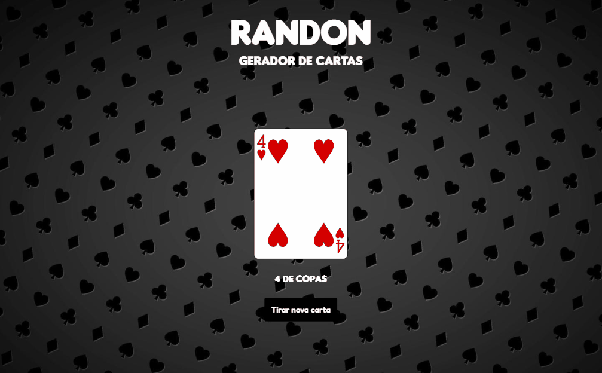
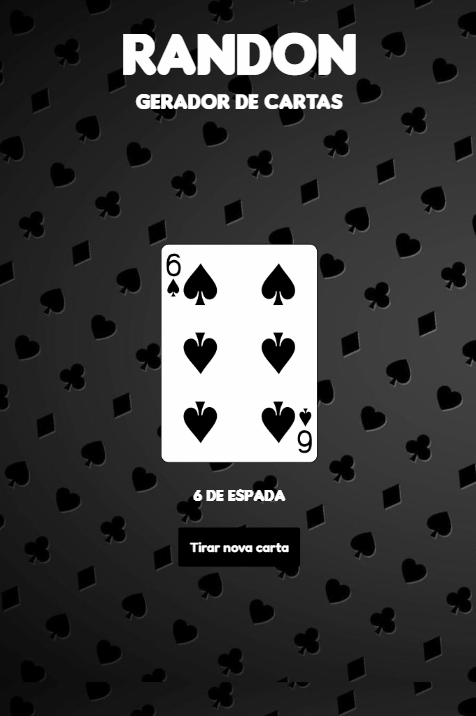
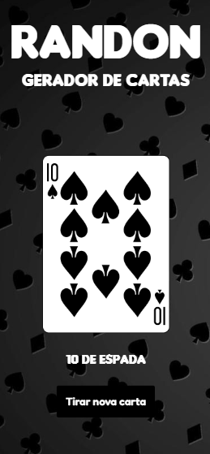

# Projeto-api-cartas-randon

## Sumário

- [Sobre o projeto](#sobreoprojeto)
- [Layout  desktop](#layout-desktop)
- [Layout tablet](#layout-tablet)
- [Layout mobile](#layout-mobile)

- [Tecnologias utilizadas](#tecnologias-utilizadas)
- [O que eu aprendi](#o-que-eu-aprendi)
- [Acesso a página](#acesso-a-página)

## Sobre o projeto

Neste projeto escolhi a API pública [Deck of Cards  ](https://deckofcardsapi.com/),  que permite aos desenvolvedores acessar e utilizar um baralho de cartas virtual através de solicitações HTTP. A Deck of Cards fornece endpoints para embaralhar o baralho, distribuir cartas aleatórias, criar novos baralhos, entre outras funcionalidades relacionadas ao baralho de cartas. A documentação da API foi fundamental para entender como fazer as solicitações e processar as respostas.
Com a ajuda do método fetch(), criei uma função que faz solicitações à API e retorna os dados em formato JSON. Em seguida, manipulei os dados recebidos para exibir as informações que eu precisava na tela do meu projeto. Foi muito legal ver as cartas sendo atualizadas em tempo real!
 
 

## Layout desktop    

 

 
 
 

## Layout tablet

 
 

 

## Layout mobile

 
 

 

## Tecnologias utilizadas

- HTML
- CSS
- JS

## O que eu aprendi
Este projeto me mostrou como as APIs são importantes para obter informações de fontes externas e como o método fetch() é útil para fazer solicitações assíncronas em JavaScript. Embora o foco principal do projeto tenha sido o consumo da api, também coloquei em prática os conhecimentos no uso html semâmtico e flebox.
## Acesso a página

Para ver o projeto pronto [clique aqui ](https://claricassia.github.io/Projeto-api-cartas-randon/)
